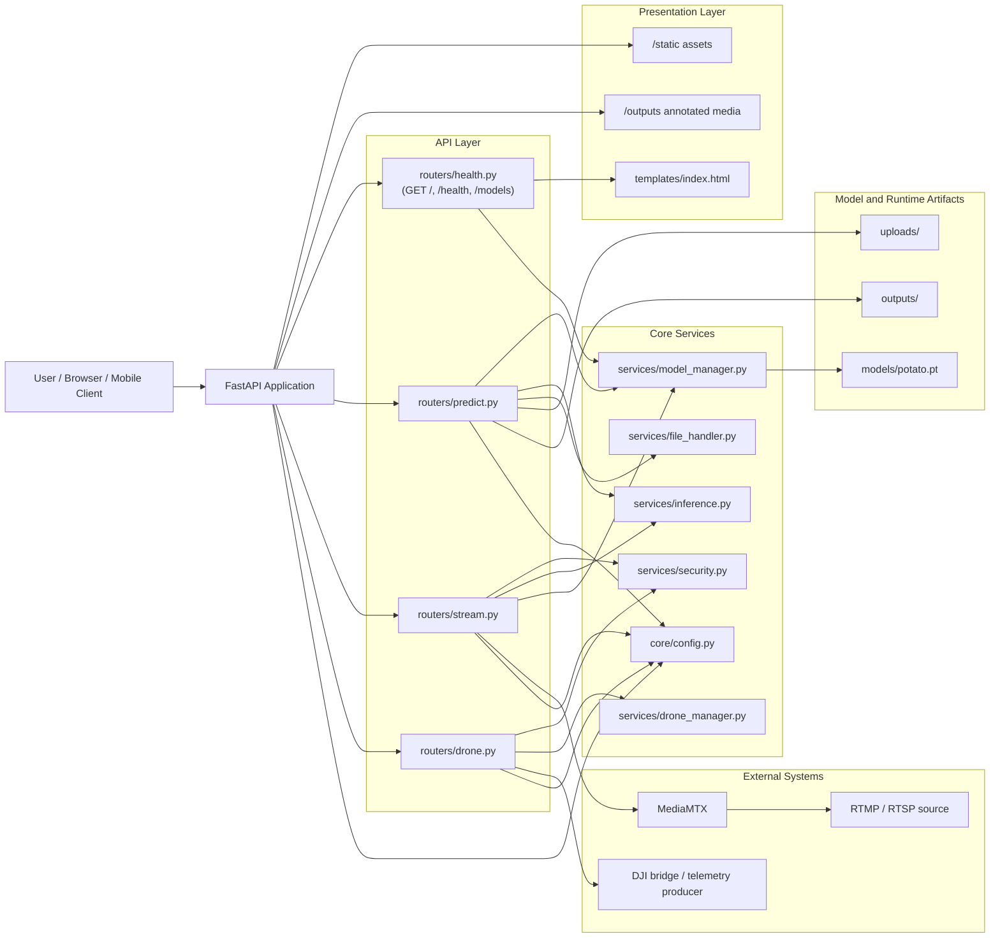
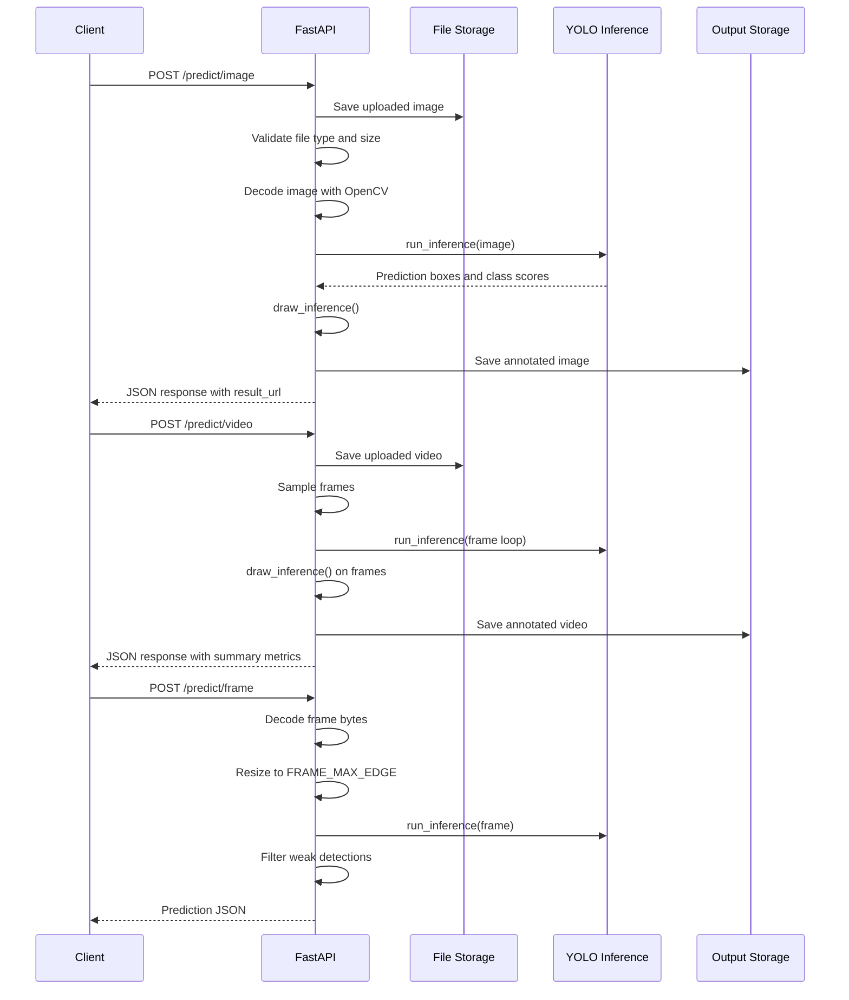
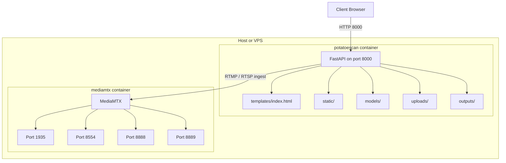

# PotatoScan Paper Figures

This file contains paper-ready source diagrams for the PotatoScan system. The figures are based on the current FastAPI, YOLO, stream, and drone bridge implementation in this repository.

## Figure 1. System Architecture

Caption: PotatoScan is organized as a FastAPI application with separate routers for health, prediction, streaming, and drone control. Model loading and inference are isolated in service modules, while annotated results are stored in `outputs/` and temporary uploads are stored in `uploads/`.

## Figure 2. Inference Workflow

Caption: The inference pipeline supports image, video, and frame inputs. Uploaded media is processed in memory or from temporary files, passed through YOLO-based inference, and returned either as structured JSON or as annotated output files.

## Figure 3. Deployment Topology

Caption: PotatoScan is deployed as two cooperating containers. The FastAPI container serves the web UI and inference API, while MediaMTX provides the stream ingestion layer used for live RTMP/RTSP processing.

## Notes For Paper Export

- Use these Mermaid sources to export SVG or PNG figures for the paper.
- Keep the architecture figure for the system overview.
- Keep the sequence figure for the inference method section.
- Keep the deployment figure for the implementation or infrastructure section.
- If the journal does not accept Mermaid directly, export the diagrams before submission.
